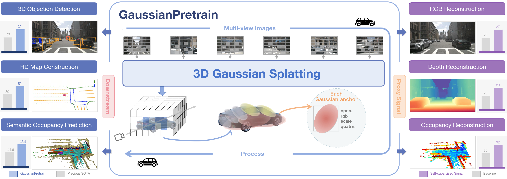
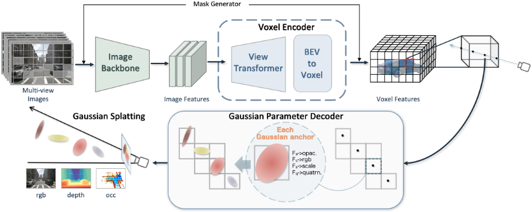

# GaussianPretrain: A Simple Unified 3D Gaussian Representation for Visual Pre-training in Autonomous Driving
### [Paper] | [Project Page]

Authors

## Introduction

💥GussianPretrain introduces 3D Gaussian Splatting technology into vision pre-training task for the first time.
Which demonstrates remarkable effectiveness and robustness, achieving significant improvements
across various 3D perception tasks, including 3D object detection, HD map reconstruction, and occupancy prediction,
with efficiency and lower memory consumption.💥

  

## News

- [2024-12-12] The codebase is initialed. We are diligently preparing for a clean, optimized version. Stay tuned for the complete code release, which is coming soon.. 

## Overview
💥The architecture of proposed GaussianPretrain. Given multi-view images, we first extract valid mask patches using the mask generator with the LiDAR Depth Guidance strategy. Subsequently, a set of learnable 3D Gaussian anchors is generated using ray-based guidance and conceptualized as volumetric LiDAR points. Finally, the reconstruction signals of RGB, Depth, and Occupancy are decoded based on the predicted Gaussian anchor parameters.

  

## Main Results
## Getting Started